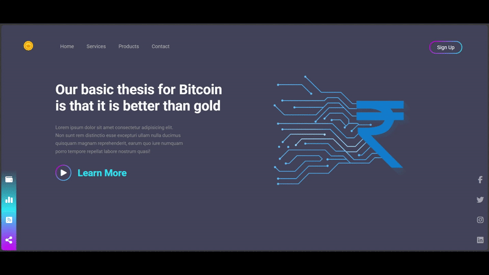

# 💰 Crypto Currency Landing Page

A clean and stylish landing page for a crypto-themed website, built with semantic HTML5 and modular CSS. This project emphasizes modern visual design, layout structure, and subtle UI animation — all without using JavaScript.

## 🚀 Live Demo

## 🧠 What I Practiced

- Structuring semantic and accessible HTML
- Styling with modular, maintainable CSS
- Using gradients for buttons and background elements
- Applying hover and focus effects for interactivity
- Implementing smooth entry animations using `@keyframes`
- Leveraging Google Fonts (`Roboto`) for consistent typography
- Designing a visually balanced layout using absolute and float positioning
- Enhancing UI polish without JavaScript

## 🔧 Tech Stack

- HTML5
- CSS3 (no frameworks)
- Google Fonts (`Roboto`)
- Font Awesome (CDN)

## 🎯 Features

- Fixed-position `Sign Up` button with gradient border animation
- Gradient play button with interactive hover and focus effects
- Intro animation on banner section using `@keyframes`
- Minimal but meaningful layout using `float` and `position: absolute`
- Quick-access and social media icons with hover scaling
- Mobile-first structure in place (responsive enhancements optional)

## 📝 Notes

This project reflects my front-end development progress, especially in crafting static layouts with strong visual identity. It focuses on fundamentals — layout, typography, gradients, and accessible interactivity — serving as a base for future JavaScript or framework-based enhancements.

> Built with pure HTML and CSS — no frameworks, no libraries, just fundamentals.
