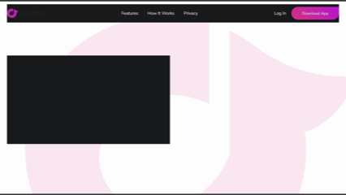

# ✨ Animated Landing Page

A fully animated, modern landing page built with semantic HTML5 and modular CSS. This project focuses on layout structure, UI polish, and entrance animations that enhance user experience without JavaScript.

## Live Demo

## 🧠 What I Practiced

- Writing semantic and accessible HTML structure
- Styling with maintainable, section-based CSS
- Implementing UI animations using `@keyframes`, `animation-delay`, `animation-duration`, and `animation-fill-mode`
- Creating utility classes for animation control
- Designing gradient buttons with hover transitions
- Using Google Fonts for consistent typography
- Positioning feature images with absolute layout techniques
- Managing animation timing without JavaScript

## 🔧 Tech Stack

- HTML5
- CSS3 (no frameworks)
- Google Fonts (`Nunito Sans`)

## 🎯 Features

- Responsive `flexbox`-based navbar
- Entry animations on text, CTA button, and image
- Gradient buttons with animated corner radius on hover
- Clean, mobile-prepared structure (with room to expand responsiveness)
- Class utilities like `.fade-in`, `.duration-1`, `.delay-animation-*`

## 📝 Notes

This project is part of my front-end learning journey focused on UI/UX, layout mastery, and animation timing. It serves as a foundational piece for more advanced interactive UI builds.

> Built with pure HTML and CSS — no libraries, no frameworks, just fundamentals.
